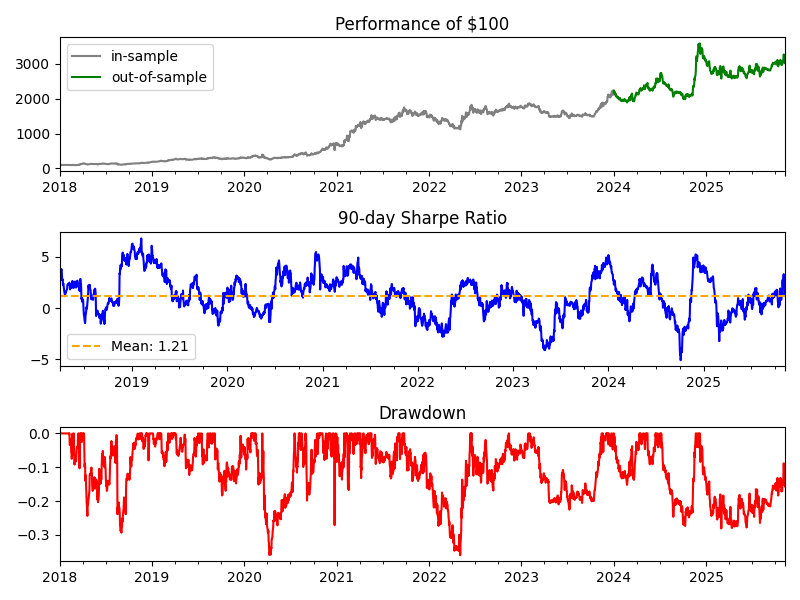

# Crypto Factor Research Series

This repository contains a growing collection of systematic research notes on predictive factors in cryptocurrency derivatives markets.

Each factor is analyzed using a survivorship-bias-free Binance perpetuals universe, a clean in-sample / out-of-sample split, and a consistent cross-sectional long/short portfolio framework with realistic transaction-cost assumptions.

A reusable Factor Research Template (Jupyter notebook) is included to standardize analysis across factors—covering signal construction, cohort segmentation, sensitivity testing, portfolio simulation, and robustness evaluation.

---

### Price Momentum

- Definition : Simple N-day Price Momentum
- Formula : price.pct_change(N)

Research Note : [Price Momentum](https://github.com/chickenopoulos/crypto-factors/blob/main/research_notes/Price%20Momentum.pdf)
